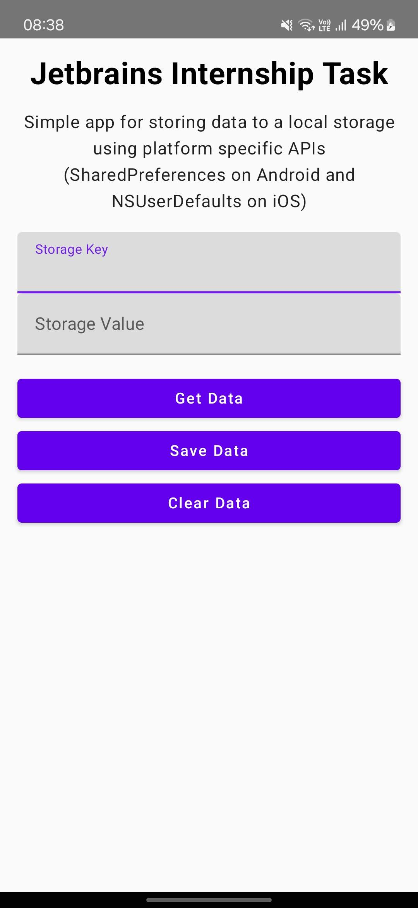

# Jetbrains Internship Task
## AI Generator for Kotlin Multiplatform Mobile Apps

### Approach
As with every new technology, I like to briefly browse the documentation or watch some YouTube videos to get a general idea of what it is about. This [video](https://www.youtube.com/watch?v=bSNumV04y_w) from JetBrains was released just a day ago at the time of writing this report, and it was helpful. Then, I followed the "Get Started" page and created a project using the KMP wizard. I encountered some issues while building the project. I also tried creating a project using Android Studio, but that one had a different structure. Allegedly, this should be KMM (Kotlin Multiplatform Mobile), unless I was misled by LLMs. I continued working on the project created through the KMP wizard, and the build problems were resolved by invalidating the caches. I decided to develop an app that saves data into local storage (using SharedPreferences on Android and NSUserDefaults on iOS).

### Implementation
#### AI Code
I decided to implement a platform-specific API call with the help of AI. Initially, I worked with Claude. The prompt I used was very basic and not detailed:
```
I would like to generate access code to a local storage for a write and read operations on Kotlin Multiplatform.
```

The prompt generated a lot of code, more than I had asked for. It included operations beyond just reading and writing. It also implemented a Factory pattern, which was probably overkill for my use case. I started copying certain parts and pasting the code into my project, and everything began to make perfect sense. The files were nicely split across multiple folders.

`composeApp/src/commonMain/kotlin/package/LocalStorage.kt` - shared code that based on the platform will resolve to the correct implementation\
`composeApp/src/iosMain/kotlin/package/LocalStorage.ios.kt` - actual implementation for iOS\
`composeApp/src/androidMain/kotlin/package/LocalStorage.android.kt` - actual implementation for Android

After this, I needed to check how to actually use it. I noticed that Android Studio is equipped with the Gemini assistant. I pasted the `LocalStorage.kt` class into Gemini and asked how to use it. The output was usable.

To use local storage in my `App.kt` file, where our layout lies, I needed to modify the entry points for each specific platform and pass local storage as an argument. In the case of Android, it is `MainActivity.kt`, and in iOS, it is `MainViewController.kt`. After this, essentially, the feature was done.

#### My Own Code
The UI of the app was implemented by me. It was pretty straightforward. I leveraged the default UI and just added some text fields, buttons, and polished it a bit. Of course, I had to Google some attributes if I could not figure them out on my own. I chose to build it on my own because I have experience with Flutter, which also has a similar way of building UIs, and I really liked that about Flutter. This approach is much better than the old XML files.

### Result
Very basic minimal app.\
